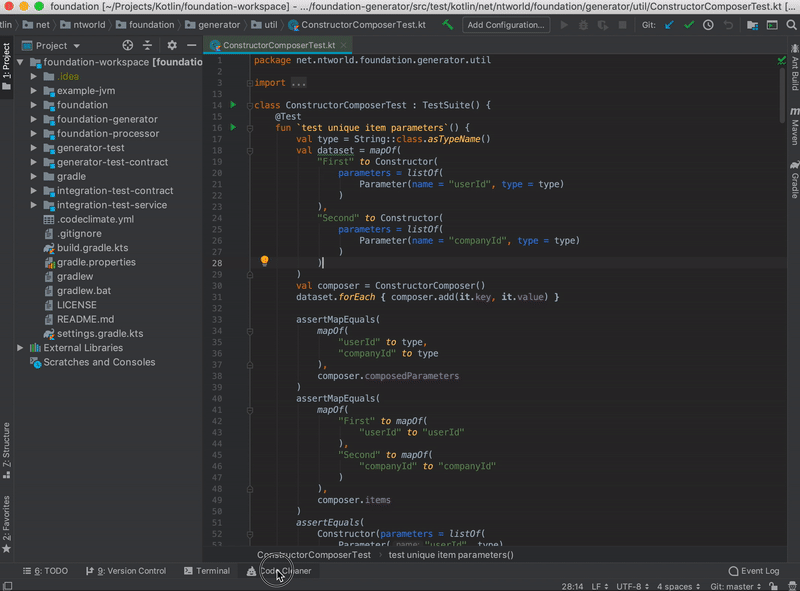

# Awesome PyCharm Plugins [](https://github.com/sindresorhus/awesome)

A curated list of awesome PyCharm plugins.
List of all plugins can be found in [here](https://plugins.jetbrains.com/pycharm).

Inspired by [awesome-python](https://github.com/vinta/awesome-python).

- [Awesome PyCharm Plugins](#awesome-pycharm-plugins)
    - [Code tools](#Code-tools)
    - [Algorithms and Design Patterns](#algorithms-and-design-patterns)
- [Resources](#resources)
    - [Books](#books)
    - [Websites](#websites)
    - [Newsletters](#newsletters)
    - [Podcasts](#podcasts)
- [Contributing](#contributing)

---
# [Code tools](https://plugins.jetbrains.com/tag/15-code-tools)

## Save Actions

GOOD

[Alexandre DuBreuil](https://www.github.com/dubreuia)  4.7 out of 5

49 Ratings  666 028 Downloads  (last update Feb 01, 2020)

[https://plugins.jetbrains.com/plugin/7642-save-actions](https://plugins.jetbrains.com/plugin/7642-save-actions)

Helps configuring "save actions" like, optimize imports, reformat code and more on **every file save**.


Very useful !


[Inspection](https://plugins.jetbrains.com/tag/3-inspection)


## Python Annotations

GOOD

[Meanmail](https://meanmail.ru/)  14,930 Downloads  Apr 19, 2020

[https://plugins.jetbrains.com/plugin/12035-python-annotations](https://plugins.jetbrains.com/plugin/12035-python-annotations)

Implement some quick type hint code inspections and quickfixes.
```python
# before

def str_to_int(value: str) -> Union[int, None]:

    ...

# after quickfix

def str_to_int(value: str) -> Optional[int]:
```


Can be useful, at least not harmful


## Code Cleaner with Code Climate CL
[Nhat Phan](https://github.com/nhat-phan)  

- 2 Ratings  4.6 out of 5
- 3,023 Downloads
- Dec 15, 2019

Implements code inspections to find different bad code smells (only works for linux/mac)



[https://plugins.jetbrains.com/plugin/13306-code-cleaner-with-code-climate-cli](https://plugins.jetbrains.com/plugin/13306-code-cleaner-with-code-climate-cli)


## SonarLint

[SonarSource](https://www.sonarsource.com/)   

- 38 Ratings    3.3 out of 5
- 2,618,338 Downloads
- Jul 15, 2020

[sonarlint](https://plugins.jetbrains.com/plugin/7973-sonarlint)

Code inspection to find bug/vunerabilities.
 
 

I’d say this is worth a download

## Pylint

[Roberto Leinardi](https://github.com/leinardi/pylint-pycharm) 119 350 Downloads
https://plugins.jetbrains.com/plugin/11084-pylint

This plugin provides both real-time and on-demand scanning of Python files with Pylint from within the PyCharm IDE.


[https://plugins.jetbrains.com/plugin/11084-pylint](https://plugins.jetbrains.com/plugin/11084-pylint)

# [Code editing](https://plugins.jetbrains.com/tag/89-code-editing)

## Emoji Support Plugin

[Shiraji](http://github.com/shiraji)

[Emoji Support Plugin - IntelliJ IDEs](https://plugins.jetbrains.com/plugin/9174-emoji-support-plugin)

[Yet another emoji support - IntelliJ IDEs](https://plugins.jetbrains.com/plugin/12512-yet-another-emoji-support)

Emoji support inside the IDE


Both from the same author, YAES seems to be newer but both are maintained.

Might be useful for teams when coordinating emoji meanings.
However, colorful emojis are only in mac OS :( [link](https://stackoverflow.com/questions/43004882/how-to-add-an-emoji-to-comment-in-intellij-idea-2017-1/43005177)

This is how it looks on Linux/Windows.


# [Miscellaneous](https://plugins.jetbrains.com/tag/104-miscellaneous)

## Archive browser
[Ilya Usanov](https://github.com/b3er/idea-archive-browser) 4.1 out of 5

- 18 Ratings 
- 74,506 Downloads
- Mar 30, 2019

[archive-browser](https://plugins.jetbrains.com/plugin/9491-archive-browser)

This plugin allows you to browse most archives like folders in IDEA.

## Dictionary

[Lost-World](https://github.com/olivernybroe/intellij-Dictionary)  

2 Ratings  4.6 out of 5
1 120 Downloads
Mar 20, 2019

[Dictionary - plugin for IntelliJ IDEs](https://plugins.jetbrains.com/plugin/12089-dictionary)

Plugin for having a shared dictionary for all members of your project.

Great idea.
Takes some restarting and moving the ‘project.dic’ file to work.

## PyCharm Help

[JetBrains s.r.o.](https://plugins.jetbrains.com/organization/JetBrains)   16 236 Downloads

[https://plugins.jetbrains.com/plugin/9993-pycharm-help](https://plugins.jetbrains.com/plugin/9993-pycharm-help)

PyCharm Web Help for offline use.

Just that

# [User Interface](https://plugins.jetbrains.com/tag/13-user-interface)

## CPU Usage Indicator

[Vojtech Krasa](https://github.com/krasa/CpuUsageIndicator) 4.7 out of 5

- 3 Ratings
- 38,182 Downloads
- 

[https://plugins.jetbrains.com/plugin/8580-cpu-usage-indicator](https://plugins.jetbrains.com/plugin/8580-cpu-usage-indicator)

Self explanatory, pretty cool.


## GPU Monitor

[Andrew Peng](https://andrewpeng.dev/)

-
- 990 Downloads
- 
**Works up to 2019.3.5**

[gpu-monitor](https://plugins.jetbrains.com/plugin/13597-gpu-monitor)

Provides GPU stats from the IDE


## Extra Icons

[Jonathan Lermitage](https://github.com/jonathanlermitage) 

- 12 Ratings. 4.7 out of 5
- 182,800 Downloads

[https://plugins.jetbrains.com/plugin/11058-extra-icons](https://plugins.jetbrains.com/plugin/11058-extra-icons)

Add icons for files like Travis YML, Appveyor YML, etc.


Would disable icons for common files like .gitignore and .md

## Rainbow Brackets

[Izhangzhihao](https://github.com/izhangzhihao)

- 94 Ratings. 4.8 out of 5
- 3,045,674 Downloads
- Jul 25, 2020


Pretty useful, very popular

# [Unit testing](https://plugins.jetbrains.com/tag/86-unit-testing)


# [Tools integration](https://plugins.jetbrains.com/tag/19-tools-integration)

## BlackConnect

[Kirill Borisov](https://github.com/lensvol/) 

- 2 Ratings. 4.4 out of 5
- 997 Downloads
- Jul 25, 2020

[https://plugins.jetbrains.com/plugin/14321-blackconnect](https://plugins.jetbrains.com/plugin/14321-blackconnect)

Connect to [blackd](https://black.readthedocs.io/en/stable/blackd.html) and format your Python code without creating a new **black** process!


Pretty good. Can work in addition to Save Actions.

## Data Version Control (DVC) Support

[David Příhoda](http://dvc.org/) 

1 Rating  4.5 out of 5
1,506 Downloads
Feb 03, 2019

[https://plugins.jetbrains.com/plugin/11368-data-version-control-dvc-support](https://plugins.jetbrains.com/plugin/11368-data-version-control-dvc-support)

Data Version Control (DVC) file support.

## Gitlab Integrations

### Merge Request Integration CE - Code Review for GitLab

[Nhat's Team](https://plugins.jetbrains.com/organization/ntworld) 

 - 23 Ratings  4.4 out of 5
 - 13,572 Downloads
 - Apr 21, 2020

[https://plugins.jetbrains.com/plugin/13607-merge-request-integration-ce--code-review-for-gitlab](https://plugins.jetbrains.com/plugin/13607-merge-request-integration-ce--code-review-for-gitlab)

Merge Request Integration is a plugin which helps you to do Code Review right in your IDE.

What you can do:

1. Filter Merge Requests which are assigned to you, waiting for your approval, etc

2. Check pipeline status and approval status.

3. Do code review, navigate code with Diff View right in your IDE.

4. Add and reply a comment

5. Approve/revoke your approval

6. More and more features will be coming soon :)

Currently, the plugin supports GitLab only (gitlab cloud and self-hosted).

AWESOME !


#### Other Gitlab plugins
[https://plugins.jetbrains.com/plugin/11149-gitlab-quick-merge-request](https://plugins.jetbrains.com/plugin/11149-gitlab-quick-merge-request) - Just able to create a merge request

[https://plugins.jetbrains.com/plugin/14110-gitlab-projects-2020](https://plugins.jetbrains.com/plugin/14110-gitlab-projects-2020) - Also offers gitlab integration (view merge requests, etc). Doesn’t seem to support self-hosted

## Jira Integration

[Adriel Saa Romano](https://gitlab.com/adrielsr/jira-intellij-plugin)  

- 23 Ratings  3.2 out of 5
- 52,470 Downloads
- Aug 02, 2020

[https://plugins.jetbrains.com/plugin/11169-jira-integration](https://plugins.jetbrains.com/plugin/11169-jira-integration)

Adds a small tab to show JIRA issues, etc.


## Big Data Tools

[JetBrains s.r.o.](https://plugins.jetbrains.com/organization/JetBrains) 

- 11 Ratings. 4.3 out of 5
- 184,373 Downloads
- Jul 27, 2020

[https://plugins.jetbrains.com/plugin/12494-big-data-tools](https://plugins.jetbrains.com/plugin/12494-big-data-tools)
**Integrated tools for Zeppelin, Spark, and S3**

With this plugin, you can conveniently work with **Zeppelin** notebooks, **Spark** applications, and **S3** files right from **IntelliJ IDEA Ultimate**. 

Support should python zeppelin notebooks should be added soon.


## Jenkins Control Plugin

[Programisci.eu David Boissier, Yuri Novitsky (support of PPP), Michael Suhr](https://github.com/MCMicS/jenkins-control-plugin/issues)   

- 19 Ratings 3.7 out of 5   
- 188,314 Downloads  
- Jul 28, 2020

[https://plugins.jetbrains.com/plugin/6110-jenkins-control-plugin](https://plugins.jetbrains.com/plugin/6110-jenkins-control-plugin)

**Integrates Jenkins in IntelliJ**

**Features:**

1. View Jobs

2. Trigger Jobs

3. Show Log for Job

4. Show Job Result as JUnit View

5. Multibranch support

Seems pretty cool.


# [Languages](https://plugins.jetbrains.com/tag/48-languages)

## BashSupport

[Joachim Ansorg](https://www.plugin-dev.com/)

[https://plugins.jetbrains.com/plugin/4230-bashsupport](https://plugins.jetbrains.com/plugin/4230-bashsupport)

Retired. As Shell Script was bundled with the jetbrains platform.

Bash language support for the IntelliJ platform.

Supports run configurations, syntax highlighting, rename, documentation lookup, inspections, quickfixes and more.

## CSV Plugin

[Martin Sommer](https://github.com/SeeSharpSoft/intellij-csv-validator) 

- 20 Ratings. 4.3 out of 5
- 4,370,366 Downloads

Lightweight plugin for editing CSV/TSV/PSV files with a flexible table editor, syntax validation, structure highlighting, customizable coloring, new intentions and helpful inspections.


Seems pretty nice !


# Themes

[Darcula Darker Theme - theme for IntelliJ IDEs](https://plugins.jetbrains.com/plugin/12692-darcula-darker-theme)

[Dark Purple Theme - theme for IntelliJ IDEs | JetBrains](https://plugins.jetbrains.com/plugin/12100-dark-purple-theme)

[One Dark theme - theme for IntelliJ IDEs](https://plugins.jetbrains.com/plugin/11938-one-dark-theme)

[Material Theme UI - theme for IntelliJ IDEs | JetBrains](https://plugins.jetbrains.com/plugin/8006-material-theme-ui)


# [Spellcheck](https://plugins.jetbrains.com/tag/179-spellcheck)

## Grazie

[JetBrains s.r.o.](https://plugins.jetbrains.com/organization/JetBrains) 

- 29 Ratings   4.9 out of 5
- 186,545 Downloads
- Jul 16, 2020

[https://plugins.jetbrains.com/plugin/12175-grazie](https://plugins.jetbrains.com/plugin/12175-grazie)

Provides intelligent spelling and grammar checks for text that you write in the IDE.

Supports over 15 languages, including English, German, Russian, Chinese, and others.

A MUST

# [Refactoring](https://plugins.jetbrains.com/tag/51-refactoring)

## Sourcery

[Sourcery](https://sourcery.ai/)   

1 Rating  4.5 out of 5
6 205 Downloads
Jul 31, 2020

[https://plugins.jetbrains.com/plugin/12631-sourcery](https://plugins.jetbrains.com/plugin/12631-sourcery)

Sourcery instantly refactors Python using AI. Write better code faster.

Sends code to the server to be analyzed. Might be cool. There’s a free tier and higher.


# [PDF](https://plugins.jetbrains.com/tag/55-pdf)

## PDF Viewer

[FirstTimeInForever](https://github.com/FirstTimeInForever/intellij-pdf-viewer)

- 4 Ratings  4.7 out of 5
- 348 Downloads
- Jul 10, 2020

[https://plugins.jetbrains.com/plugin/14494-pdf-viewer](https://plugins.jetbrains.com/plugin/14494-pdf-viewer)

PDF viewer inside the IDE.  


# [Reporting](https://plugins.jetbrains.com/tag/39-reporting)

## WakaTime

[WakaTime](https://wakatime.com/)  

- 9 Ratings  4.5 out of 5
- 414,887 Downloads
- Mar 06, 2020

[WakaTime - plugin for IntelliJ IDEs | JetBrains](https://plugins.jetbrains.com/plugin/7425-wakatime)

Tracks IDE times, sends to a web service which then shows visualizations of it.

Pretty cool.

[Code Time - plugin for IntelliJ IDEs | JetBrains](https://plugins.jetbrains.com/plugin/10687-code-time/) is a similar alternative


# [Fun stuff](https://plugins.jetbrains.com/tag/16-fun-stuff)

## Power Mode II

[Alexander Thom](https://github.com/axaluss/power-mode-intellij-plugin)  

24 Ratings  4.7 out of 5
230 064 Downloads

[Power Mode II - plugin for IntelliJ IDEs](https://plugins.jetbrains.com/plugin/8251-power-mode-ii)


Not my cup of tea but pretty popular

## Progress Bars

[https://plugins.jetbrains.com/plugin/13709-dash-progress-bar](https://plugins.jetbrains.com/plugin/13709-dash-progress-bar)

[https://plugins.jetbrains.com/plugin/8575-nyan-progress-bar](https://plugins.jetbrains.com/plugin/8575-nyan-progress-bar)

[https://plugins.jetbrains.com/plugin/14609-pokemon-trainer-progress-bar/](https://plugins.jetbrains.com/plugin/14609-pokemon-trainer-progress-bar/)

[https://plugins.jetbrains.com/plugin/14708-mario-progress-bar/](https://plugins.jetbrains.com/plugin/14708-mario-progress-bar/)

[https://plugins.jetbrains.com/plugin/14725-sonic-progress-bar/](https://plugins.jetbrains.com/plugin/14725-sonic-progress-bar/)

[https://plugins.jetbrains.com/plugin/14726-zelda-progress-bar/](https://plugins.jetbrains.com/plugin/14726-zelda-progress-bar/)

One is a must

# [Build](https://plugins.jetbrains.com/tag/87-build)

## File Watchers

[JetBrains s.r.o.](https://plugins.jetbrains.com/organization/JetBrains)

- 12 Ratings. 4.0 out of 5
- 1,013,992 Downloads
- 

[https://plugins.jetbrains.com/plugin/7177-file-watchers](https://plugins.jetbrains.com/plugin/7177-file-watchers)

Allows executing tasks triggered by file modifications

[https://www.jetbrains.com/help/pycharm/using-file-watchers.html](https://www.jetbrains.com/help/pycharm/using-file-watchers.html)

Similar to save actions, pretty nice

No guide on how to use it, can be useful for customizing.


# [Apps, Notification and Interaction Applications](https://plugins.jetbrains.com/tag/96-apps-notification-and-interaction-applications)

## Key Promoter X

[Hal's Corner](https://plugins.jetbrains.com/organization/halirutan)

- 345 Ratings. 5.0 out of 5
- 1,317,042 Downloads
- 

[https://plugins.jetbrains.com/plugin/9792-key-promoter-x](https://plugins.jetbrains.com/plugin/9792-key-promoter-x)

The Key Promoter X helps you to learn essential shortcuts while you are working.


**AWESOME. A MUST**

# [Version Control](https://plugins.jetbrains.com/tag/6-version-control)

## .ignore

[Hsz](http://ignore.hsz.mobi/)  

- 73 Ratings. 4.0 out of 5
- 10,431,806 Downloads
- 

**.ignore** is a plugin for *.gitignore (Git), .hgignore (Mercurial), .npmignore (NPM), .dockerignore (Docker)*

A MUST

## Conventional Commit

[Edoardo Luppi](https://github.com/lppedd/idea-conventional-commit)  

- 3 Ratings. 4.7 out of 5
- 7 707 Downloads  
- 11.06.2020

[https://plugins.jetbrains.com/plugin/13389-conventional-commit](https://plugins.jetbrains.com/plugin/13389-conventional-commit)

The aim of this plugin is to provide completion for [conventional commits](https://conventionalcommits.org/), also named *semantic commits*, inside the VCS Commit dialog.


Very flexible and fluent. However it doesn’t **enforce**.

I prefer it over Git Commit Template

**Extension for commitlint**

[https://github.com/lppedd/idea-conventional-commit-commitlint](https://github.com/lppedd/idea-conventional-commit-commitlint)


# [Editor](https://plugins.jetbrains.com/tag/25-editor)

## Quick File Preview

[Martin Sommer](https://github.com/SeeSharpSoft/intellij-file-preview)  

- 29 Ratings. 5.0 out of 5
- 60,599 Downloads
- 
[https://plugins.jetbrains.com/plugin/12778-quick-file-preview/](https://plugins.jetbrains.com/plugin/12778-quick-file-preview/)


Close to the new Git commit view, seems nice

Very nice. Closes window after clicking on a different file


## Python custom import
orleviad

- 
- 3000+ Downloads
- Apr 27, 2020

Plugin that copy import in python interpreter style.
Very useful for various scenarios such as copying imports to notebook.


Paste anywhere:


# [Viewer](https://plugins.jetbrains.com/tag/56-viewer)

## OpenCV Image Viewer

Adrian Boguszewski  

- 1 Rating. 4.5 out of 5
- 6 22 Downloads

[https://plugins.jetbrains.com/plugin/14371-opencv-image-viewer](https://plugins.jetbrains.com/plugin/14371-opencv-image-viewer)

Treats numpy array as an image and displays its content.


If you use images in numpy arrays, why not ?


# [VCS integration](https://plugins.jetbrains.com/tag/5-vcs-integration)

## Remote repository checker

Ivkond  
- 156 Downloads (from march 02, 2020)

Works with version up to 2019.2

[https://plugins.jetbrains.com/plugin/13877-remote-repository-checker](https://plugins.jetbrains.com/plugin/13877-remote-repository-checker)

This plugin allows you to get notifications about remote Git repository updates.
