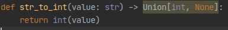

# Awesome PyCharm Plugins [](https://github.com/sindresorhus/awesome)

A curated list of awesome PyCharm plugins.
List of all plugins can be found in [here](https://plugins.jetbrains.com/pycharm).

Inspired by [awesome-python](https://github.com/vinta/awesome-python).

- Code Tools
    - [Save Actions](#save-actions)
    - [Python Annotations](#python-annotations)
    - [Code Cleaner with Code Climate CL](#code-cleaner-with-code-climate-cl)
    - [SonarLint](#sonarlint)
    - [Pylint](#pylint)
- Code Editing
    - [Emoji Support Plugin](#emoji-support-plugin)
- Miscellaneous
    - [Archive browser](#archive-browser)
    - [Dictionary](#dictionary)
    - [PyCharm Help](#pycharm-help)
- User Interface
    - [CPU Usage Indicator](#cpu-usage-indicator)
    - [GPU Monitor](#gpu-monitor)
    - [Rainbow Brackets](#rainbow-brackets)
    - [Extra Icons](#extra-icons)
- Tools integration
    - [BlackConnect](#blackconnect)
    - [Data Version Control (DVC) Support](#data-version-control-dvc-support)
    - [Gitlab Integrations](#gitlab-integrations)
    - [Jira Integration](#jira-integration)
    - [Big Data Tools](#big-data-tools)
    - [Jenkins Control Plugin](#jenkins-control-plugin)
- Languages
    - [BashSupport](#bashsupport)
    - [CSV Plugin](#csv-plugin)    
- [Themes](#themes)   
- Spellcheck
    - [Grazie](#grazie)     
- Refactoring
    - [Sourcery](#sourcery)  
- PDF
    - [PDF Viewer](#pdf-viewer)
- Languages
    - [BashSupport](#bashsupport)
    - [CSV Plugin](#csv-plugin)
- Reporting
    - [BashSupport](#bashsupport)
    - [CSV Plugin](#csv-plugin)
- Fun stuff
    - [BashSupport](#bashsupport)
    - [CSV Plugin](#csv-plugin)
- Build
    - [BashSupport](#bashsupport)
    - [CSV Plugin](#csv-plugin)
- Apps, Notification and Interaction Applications
    - [BashSupport](#bashsupport)
    - [CSV Plugin](#csv-plugin)
- Version Control
    - [BashSupport](#bashsupport)
    - [CSV Plugin](#csv-plugin)
- Editor
    - [BashSupport](#bashsupport)
    - [CSV Plugin](#csv-plugin)
- Viewer
    - [BashSupport](#bashsupport)
    - [CSV Plugin](#csv-plugin)    
                   
- [Contributing](#contributing)

- - -

# [Code tools](https://plugins.jetbrains.com/tag/15-code-tools)

## Save Actions


[Alexandre DuBreuil](https://www.github.com/dubreuia)

- 50+ Ratings. 4.7 out of 5
- 660,000+ Downloads  
- Feb 01, 2020

Helps configure "save actions" like, "optimize imports", "reformat code" and more on **every file save**.


**Very useful !**

[https://plugins.jetbrains.com/plugin/7642-save-actions](https://plugins.jetbrains.com/plugin/7642-save-actions)


## Python Annotations

[Meanmail](https://meanmail.ru/)  

- 0+ reviews
- 15,000+ Downloads
- Apr 19, 2020


Implement some quick type hint code inspections and quickfixes.
```python
#### before

def str_to_int(value: str) -> Union[int, None]:

    ...

#### after quickfix

def str_to_int(value: str) -> Optional[int]:
```



Can be useful, at least not harmful.

[https://plugins.jetbrains.com/plugin/12035-python-annotations](https://plugins.jetbrains.com/plugin/12035-python-annotations)


## Code Cleaner with Code Climate CL
[Nhat Phan](https://github.com/nhat-phan)  

- 2+ Ratings.  4.6 out of 5
- 3,000+ Downloads
- Dec 15, 2019

Implements code inspections to find different bad code smells (only works for linux/mac)


[https://plugins.jetbrains.com/plugin/13306-code-cleaner-with-code-climate-cli](https://plugins.jetbrains.com/plugin/13306-code-cleaner-with-code-climate-cli)

## SonarLint

[SonarSource](https://www.sonarsource.com/)   

- 38+ Ratings.  3.3 out of 5
- 2,600,000+ Downloads

Code inspection to find bug/vulnerabilities.
 
 

I’d say this is worth a try.

[https://plugins.jetbrains.com/plugin/7973-sonarlint](https://plugins.jetbrains.com/plugin/7973-sonarlint)

## Pylint

[Roberto Leinardi](https://github.com/leinardi/pylint-pycharm) 119 350 Downloads

- 14+ Ratings.  4.2 out of 5
- 120,000+ Downloads

This plugin provides both real-time and on-demand scanning of Python files with Pylint from within the PyCharm IDE.


[https://plugins.jetbrains.com/plugin/11084-pylint](https://plugins.jetbrains.com/plugin/11084-pylint)

# [Code editing](https://plugins.jetbrains.com/tag/89-code-editing)

## Emoji Support Plugin

[Shiraji](http://github.com/shiraji)

[Emoji Support Plugin - IntelliJ IDEs](https://plugins.jetbrains.com/plugin/9174-emoji-support-plugin)

[Yet another emoji support - IntelliJ IDEs](https://plugins.jetbrains.com/plugin/12512-yet-another-emoji-support)

Emoji support inside the IDE


Both from the same author, YAES seems to be newer but both are maintained.

Might be useful for teams when coordinating emoji meanings.
However, colorful emojis are only in mac OS :( [link](https://stackoverflow.com/questions/43004882/how-to-add-an-emoji-to-comment-in-intellij-idea-2017-1/43005177)

This is how it looks on Linux/Windows.


# [Miscellaneous](https://plugins.jetbrains.com/tag/104-miscellaneous)

## Archive browser
[Ilya Usanov](https://github.com/b3er/idea-archive-browser)

- 18+ Ratings. 4.1 out of 5
- 75,000+ Downloads
- Mar 30, 2019

[archive-browser](https://plugins.jetbrains.com/plugin/9491-archive-browser)

This plugin allows you to browse most archives like folders in IDEA.

## Dictionary

[Lost-World](https://github.com/olivernybroe/intellij-Dictionary)  

- 2+ Ratings. 4.6 out of 5
- 1,120 Downloads
- Mar 20, 2019

Plugin for having a shared dictionary for all members of your project.

**Great idea!** Takes some restarting and moving the ‘project.dic’ file to work.

[Dictionary - plugin for IntelliJ IDEs](https://plugins.jetbrains.com/plugin/12089-dictionary)

## PyCharm Help

[JetBrains s.r.o.](https://plugins.jetbrains.com/organization/JetBrains)   16 236 Downloads

PyCharm Web Help for offline use.

[https://plugins.jetbrains.com/plugin/9993-pycharm-help](https://plugins.jetbrains.com/plugin/9993-pycharm-help)

# [User Interface](https://plugins.jetbrains.com/tag/13-user-interface)

## CPU Usage Indicator

[Vojtech Krasa](https://github.com/krasa/CpuUsageIndicator) 

- 3+ Ratings. 4.7 out of 5
- 38,000+ Downloads


[https://plugins.jetbrains.com/plugin/8580-cpu-usage-indicator](https://plugins.jetbrains.com/plugin/8580-cpu-usage-indicator)

## GPU Monitor

[Andrew Peng](https://andrewpeng.dev/)

- 990+ Downloads

**Works up to 2019.3.5**

Provides GPU stats from the IDE


[https://plugins.jetbrains.com/plugin/13597-gpu-monitor](https://plugins.jetbrains.com/plugin/13597-gpu-monitor)

## Extra Icons

[Jonathan Lermitage](https://github.com/jonathanlermitage) 

- 12+ Ratings. 4.7 out of 5
- 182,000+ Downloads

Add additional icons for files like Travis YML, Appveyor YML, etc.


Would disable icons for common files like .gitignore and .md

[https://plugins.jetbrains.com/plugin/11058-extra-icons](https://plugins.jetbrains.com/plugin/11058-extra-icons)

## Rainbow Brackets

[Izhangzhihao](https://github.com/izhangzhihao)

- 90+ Ratings. 4.8 out of 5
- 3,000,000+ Downloads
- Jul 25, 2020


Pretty useful, very popular.

[https://plugins.jetbrains.com/plugin/10080-rainbow-brackets](https://plugins.jetbrains.com/plugin/10080-rainbow-brackets)

# [Tools integration](https://plugins.jetbrains.com/tag/19-tools-integration)

## BlackConnect

[Kirill Borisov](https://github.com/lensvol/) 

- 2+ Ratings. 4.4 out of 5
- 1000+ Downloads
- Jul 25, 2020

Connect to [blackd](https://black.readthedocs.io/en/stable/blackd.html) and format your Python code without creating a new **black** process!


Pretty good. Can work in addition to Save Actions.

[https://plugins.jetbrains.com/plugin/14321-blackconnect](https://plugins.jetbrains.com/plugin/14321-blackconnect)

## Data Version Control (DVC) Support

[David Příhoda](http://dvc.org/) 

- 1+ Rating. 4.5 out of 5
- 1,500+ Downloads
- Feb 03, 2019

Data Version Control (DVC) file support.

[https://plugins.jetbrains.com/plugin/11368-data-version-control-dvc-support](https://plugins.jetbrains.com/plugin/11368-data-version-control-dvc-support)

## Gitlab Integrations

### Merge Request Integration CE - Code Review for GitLab

[Nhat's Team](https://plugins.jetbrains.com/organization/ntworld) 

 - 23+ Ratings  4.4 out of 5
 - 13,000+ Downloads
 - Apr 21, 2020

Merge Request Integration is a plugin which helps you to do Code Review right in your IDE.

What you can do:

1. Filter Merge Requests which are assigned to you, waiting for your approval, etc

2. Check pipeline status and approval status.

3. Do code review, navigate code with Diff View right in your IDE.

4. Add and reply a comment

5. Approve/revoke your approval

6. More and more features will be coming soon :)

Currently, the plugin supports GitLab only (gitlab cloud and self-hosted).


[https://plugins.jetbrains.com/plugin/13607-merge-request-integration-ce--code-review-for-gitlab](https://plugins.jetbrains.com/plugin/13607-merge-request-integration-ce--code-review-for-gitlab)

#### Other Gitlab plugins
[gitlab-quick-merge-request](https://plugins.jetbrains.com/plugin/11149-gitlab-quick-merge-request) - Just able to create a merge request

[gitlab-projects-2020](https://plugins.jetbrains.com/plugin/14110-gitlab-projects-2020) - Also offers gitlab integration (view merge requests, etc). Doesn't seem to support self-hosted.

## Jira Integration

[Adriel Saa Romano](https://gitlab.com/adrielsr/jira-intellij-plugin)  

- 23+ Ratings  3.2 out of 5
- 52,500+ Downloads
- Aug 02, 2020

Adds a small tab to show JIRA issues, etc.


[https://plugins.jetbrains.com/plugin/11169-jira-integration](https://plugins.jetbrains.com/plugin/11169-jira-integration)

## Big Data Tools

[JetBrains s.r.o.](https://plugins.jetbrains.com/organization/JetBrains) 

- 11+ Ratings. 4.3 out of 5
- 184,000+ Downloads
- Jul 27, 2020

**Integrated tools for Zeppelin, Spark, and S3**

With this plugin, you can conveniently work with **Zeppelin** notebooks, **Spark** applications, and **S3** files right from **PyCharm**. 

Support should python zeppelin notebooks should be added soon.


[https://plugins.jetbrains.com/plugin/12494-big-data-tools](https://plugins.jetbrains.com/plugin/12494-big-data-tools)

## Jenkins Control Plugin

[Programisci.eu David Boissier, Yuri Novitsky (support of PPP), Michael Suhr](https://github.com/MCMicS/jenkins-control-plugin/issues)   

- 19+ Ratings. 3.7 out of 5   
- 188,000+ Downloads  
- Jul 28, 2020


**Integrates Jenkins in IntelliJ**

**Features:**

1. View Jobs

2. Trigger Jobs

3. Show Log for Job

4. Show Job Result as JUnit View

5. Multibranch support

[https://plugins.jetbrains.com/plugin/6110-jenkins-control-plugin](https://plugins.jetbrains.com/plugin/6110-jenkins-control-plugin)

# [Languages](https://plugins.jetbrains.com/tag/48-languages)

## BashSupport

[Joachim Ansorg](https://www.plugin-dev.com/)

Retired. As "Shell Script" was bundled with the jetbrains platform.

Bash language support for the IntelliJ platform.

Supports run configurations, syntax highlighting, rename, documentation lookup, inspections, quickfixes and more.

[https://plugins.jetbrains.com/plugin/4230-bashsupport](https://plugins.jetbrains.com/plugin/4230-bashsupport)


## CSV Plugin

[Martin Sommer](https://github.com/SeeSharpSoft/intellij-csv-validator) 

- 20+ Ratings. 4.3 out of 5
- 4,370,000+ Downloads

Lightweight plugin for editing CSV/TSV/PSV files with a flexible table editor, syntax validation, structure highlighting, customizable coloring, new intentions and helpful inspections.


[https://plugins.jetbrains.com/plugin/10037-csv-plugin](https://plugins.jetbrains.com/plugin/10037-csv-plugin)

# Themes

[Darcula Darker Theme - theme for IntelliJ IDEs](https://plugins.jetbrains.com/plugin/12692-darcula-darker-theme)

[Dark Purple Theme - theme for IntelliJ IDEs | JetBrains](https://plugins.jetbrains.com/plugin/12100-dark-purple-theme)

[One Dark theme - theme for IntelliJ IDEs](https://plugins.jetbrains.com/plugin/11938-one-dark-theme)

[Material Theme UI - theme for IntelliJ IDEs | JetBrains](https://plugins.jetbrains.com/plugin/8006-material-theme-ui)

# [Spellcheck](https://plugins.jetbrains.com/tag/179-spellcheck)

## Grazie

[JetBrains s.r.o.](https://plugins.jetbrains.com/organization/JetBrains) 

- 29+ Ratings. 4.9 out of 5
- 186,000+ Downloads
- Jul 16, 2020

Provides intelligent spelling and grammar checks for text that you write in the IDE.

Supports over 15 languages, including English, German, Russian, Chinese, and others.


[https://plugins.jetbrains.com/plugin/12175-grazie](https://plugins.jetbrains.com/plugin/12175-grazie)

# [Refactoring](https://plugins.jetbrains.com/tag/51-refactoring)

## Sourcery

[Sourcery](https://sourcery.ai/)   

- 1+ Rating. 4.5 out of 5
- 6,200+ Downloads
- Jul 31, 2020

Sourcery instantly refactors Python using AI. Write better code faster.

Sends code to a server to be analyzed There’s a free tier and higher.

[https://plugins.jetbrains.com/plugin/12631-sourcery](https://plugins.jetbrains.com/plugin/12631-sourcery)

# [PDF](https://plugins.jetbrains.com/tag/55-pdf)

## PDF Viewer

[FirstTimeInForever](https://github.com/FirstTimeInForever/intellij-pdf-viewer)

- 4+ Ratings. 4.7 out of 5
- 350+ Downloads
- Jul 10, 2020

PDF viewer inside the IDE.  

[https://plugins.jetbrains.com/plugin/14494-pdf-viewer](https://plugins.jetbrains.com/plugin/14494-pdf-viewer)

# [Reporting](https://plugins.jetbrains.com/tag/39-reporting)

## WakaTime

[WakaTime](https://wakatime.com/)  

- 9+ Ratings. 4.5 out of 5
- 415,000+ Downloads
- Mar 06, 2020

Tracks IDE times, sends to a web service which then shows visualizations of it.


[WakaTime - plugin for IntelliJ IDEs | JetBrains](https://plugins.jetbrains.com/plugin/7425-wakatime)


[Code Time - plugin for IntelliJ IDEs | JetBrains](https://plugins.jetbrains.com/plugin/10687-code-time/) is a similar alternative

# [Fun stuff](https://plugins.jetbrains.com/tag/16-fun-stuff)

## Power Mode II

[Alexander Thom](https://github.com/axaluss/power-mode-intellij-plugin)  

- 24+ Ratings. 4.7 out of 5
- 230,000+ Downloads


[Power Mode II - plugin for IntelliJ IDEs](https://plugins.jetbrains.com/plugin/8251-power-mode-ii)

## Progress Bars

[https://plugins.jetbrains.com/plugin/13709-dash-progress-bar](https://plugins.jetbrains.com/plugin/13709-dash-progress-bar)

[https://plugins.jetbrains.com/plugin/8575-nyan-progress-bar](https://plugins.jetbrains.com/plugin/8575-nyan-progress-bar)

[https://plugins.jetbrains.com/plugin/14609-pokemon-trainer-progress-bar/](https://plugins.jetbrains.com/plugin/14609-pokemon-trainer-progress-bar/)

[https://plugins.jetbrains.com/plugin/14708-mario-progress-bar/](https://plugins.jetbrains.com/plugin/14708-mario-progress-bar/)

[https://plugins.jetbrains.com/plugin/14725-sonic-progress-bar/](https://plugins.jetbrains.com/plugin/14725-sonic-progress-bar/)

[https://plugins.jetbrains.com/plugin/14726-zelda-progress-bar/](https://plugins.jetbrains.com/plugin/14726-zelda-progress-bar/)

One is a must.

# [Build](https://plugins.jetbrains.com/tag/87-build)

## File Watchers

[JetBrains s.r.o.](https://plugins.jetbrains.com/organization/JetBrains)

- 12+ Ratings. 4.0 out of 5
- 1,013,992 Downloads

[https://plugins.jetbrains.com/plugin/7177-file-watchers](https://plugins.jetbrains.com/plugin/7177-file-watchers)

Allows executing tasks triggered by file modifications.

Guide:
[https://www.jetbrains.com/help/pycharm/using-file-watchers.html](https://www.jetbrains.com/help/pycharm/using-file-watchers.html)

# [Apps, Notification and Interaction Applications](https://plugins.jetbrains.com/tag/96-apps-notification-and-interaction-applications)

## Key Promoter X

[Hal's Corner](https://plugins.jetbrains.com/organization/halirutan)

- 345+ Ratings. 5.0 out of 5
- 1,317,000+ Downloads


The Key Promoter X helps you to learn essential shortcuts while you are working.


**AWESOME. A MUST**

[https://plugins.jetbrains.com/plugin/9792-key-promoter-x](https://plugins.jetbrains.com/plugin/9792-key-promoter-x)

# [Version Control](https://plugins.jetbrains.com/tag/6-version-control)

## .ignore

[Hsz](http://ignore.hsz.mobi/)  

- 73+ Ratings. 4.0 out of 5
- 10,431,000+ Downloads
- Jul 31, 2020

**.ignore** is a plugin for *.gitignore (Git), .hgignore (Mercurial), .npmignore (NPM), .dockerignore (Docker)*


[https://plugins.jetbrains.com/plugin/7495--ignore](https://plugins.jetbrains.com/plugin/7495--ignore)


## Conventional Commit

[Edoardo Luppi](https://github.com/lppedd/idea-conventional-commit)  

- 3+ Ratings. 4.7 out of 5
- 7,707+ Downloads  
- Jun 10, 2020

The aim of this plugin is to provide completion for [conventional commits](https://conventionalcommits.org/), also named *semantic commits*, inside the VCS Commit dialog.


Very flexible and fluent. However, it doesn't **enforce**.

[https://plugins.jetbrains.com/plugin/13389-conventional-commit](https://plugins.jetbrains.com/plugin/13389-conventional-commit)

**Extension for commitlint**

[https://github.com/lppedd/idea-conventional-commit-commitlint](https://github.com/lppedd/idea-conventional-commit-commitlint)

# [Editor](https://plugins.jetbrains.com/tag/25-editor)

## Quick File Preview

[Martin Sommer](https://github.com/SeeSharpSoft/intellij-file-preview)  

- 29+ Ratings. 5.0 out of 5
- 60,000+ Downloads

Opens window on file click. Closes window after clicking on a different file.


[https://plugins.jetbrains.com/plugin/12778-quick-file-preview/](https://plugins.jetbrains.com/plugin/12778-quick-file-preview/)


## Python custom import
orleviad

- 0+ reviews
- 3000+ Downloads
- Apr 27, 2020

Plugin that copy import in python interpreter style.
Very useful for various scenarios such as copying imports to notebook.


Paste anywhere:


[https://plugins.jetbrains.com/plugin/12857-python-custom-import](https://plugins.jetbrains.com/plugin/12857-python-custom-import)

# [Viewer](https://plugins.jetbrains.com/tag/56-viewer)

## OpenCV Image Viewer

Adrian Boguszewski  

- 1+ Rating. 4.5 out of 5
- 600+ Downloads
- Jul 31, 2020

Treats numpy array as an image and displays its content.


If you use images in numpy arrays, why not ?

[https://plugins.jetbrains.com/plugin/14371-opencv-image-viewer](https://plugins.jetbrains.com/plugin/14371-opencv-image-viewer)


